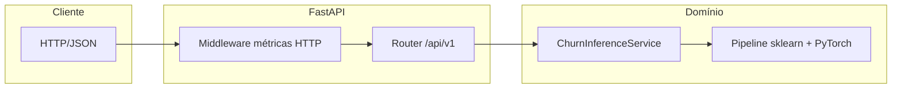
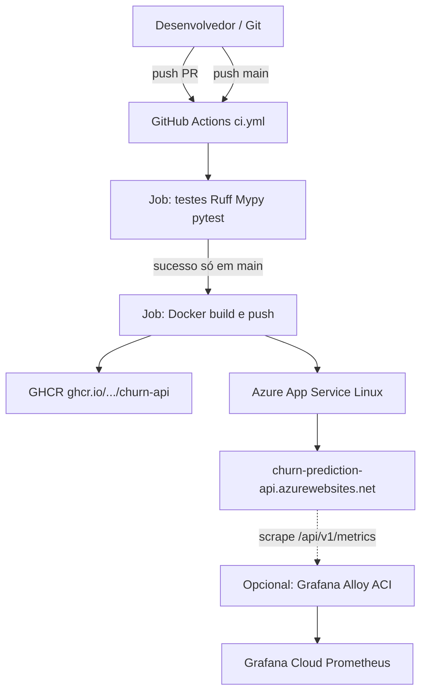

# Tech Challenge Fase 1 — MVP Churn Prediction

> **Pós-graduação FIAP Pós Tech** — **Grupo 18**

API REST de **predição de churn** para clientes de telecomunicações, servida com **FastAPI**, **Gunicorn + Uvicorn** em produção e um **pipeline de Machine Learning** serializado (scikit-learn + **PyTorch** — rede `ChurnNet`). O serviço expõe inferência, *health check*, documentação OpenAPI e métricas **Prometheus** para observabilidade.

**O que este repositório entrega (em 1 minuto):**

- **Modelo de ML empacotado** em um artefato versionado (`.pkl`) pronto para servir.
- **API HTTP** com contrato validado (schemas), *health check* e docs (`/docs`).
- **Observabilidade** com métricas Prometheus (`/api/v1/metrics/`) e dashboard no Grafana.
- **CI/CD** automatizado: testes em PR, build/deploy na `main` (GitHub Actions → GHCR → Azure App Service).

---

## Índice

1. [Links rápidos](#links-de-acesso)
2. [Visão geral](#visão-geral)
3. [Stack técnica](#stack-técnica)
4. [Objetivo do MVP e escopo](#objetivo-do-mvp-e-escopo)
5. [**Setup, execução e arquitetura**](#setup-execução-e-arquitetura) ← *guia principal para rodar o projeto*
6. [Modelo e métricas de ML](#modelo-e-métricas-de-ml)
7. [API HTTP](#api-http)
8. [Engenharia de features na inferência](#engenharia-de-features-na-inferência)
9. [KPIs de negócio (o que existe e o que falta)](#kpis-de-negócio-o-que-existe-e-o-que-falta)
10. [Configuração e variáveis de ambiente](#configuração-e-variáveis-de-ambiente)
11. [Qualidade de código e testes](#qualidade-de-código-e-testes)
12. [Container Docker](#container-docker) *(detalhe; resumo no guia acima)*
13. [CI/CD (GitHub Actions)](#cicd-github-actions)
14. [Monitoramento e observabilidade](#monitoramento-e-observabilidade)
15. [Deploy e documentação de infraestrutura](#deploy-e-documentação-de-infraestrutura)
16. [Estrutura do repositório](#estrutura-do-repositório)
17. [Trocar de modelo](#trocar-de-modelo)
18. [Solução de problemas](#solução-de-problemas)
19. [Licença](#licença)

---

## Links de Acesso

| Recurso | URL |
|---------|-----|
| **API (produção)** | https://churn-prediction-api.azurewebsites.net |
| **Health** | https://churn-prediction-api.azurewebsites.net/api/v1/health |
| **Swagger UI** | https://churn-prediction-api.azurewebsites.net/docs |
| **ReDoc** | https://churn-prediction-api.azurewebsites.net/redoc |
| **Métricas Prometheus** | https://churn-prediction-api.azurewebsites.net/api/v1/metrics/ |
| **Grafana (dashboard público)** | https://gui3561.grafana.net/public-dashboards/94cb3fd572b74d69ad10a513388d8d86 |
| **GitHub Actions** | https://github.com/gui3561-ux/grupo-18-tech-challenger-fase-1/actions |
| **Código-fonte** | https://github.com/gui3561-ux/grupo-18-tech-challenger-fase-1 |

---

## Visão geral

O sistema estima a **probabilidade de churn** (cancelamento) com base em:

- **Demografia:** gênero, idade (*senior citizen*), estado (US), parceiro, dependentes.
- **Serviços:** telefone, linhas múltiplas, internet (DSL / fibra / ausente), pacotes adicionais (segurança, backup, streaming, etc.).
- **Contrato e cobrança:** tipo de contrato, fatura digital, método de pagamento, valores e tempo de permanência (*tenure*).

**Saída da API:** probabilidade contínua em `[0, 1]`, rótulo binário (`churn_prediction`) com **threshold 0,5** no modelo, e identificador do artefato (`model`).

**Público-alvo:** times de retenção, CRM, marketing e gestão que precisam **priorizar** clientes para ações preventivas (campanhas, descontos, *save desks*).

### Por que isso importa (visão executiva)

- **Problema**: churn é uma das principais causas de perda de receita em telecom; agir tarde aumenta custo de retenção e reduz eficácia das campanhas.
- **Solução**: um serviço de inferência que entrega probabilidade/decisão de churn por cliente, com observabilidade para operar em produção.
- **Valor do MVP**: reduz o atrito entre “modelo no notebook” e “produto consumível”, deixando o caminho pronto para integrar dados reais de CRM/campanhas e gerar KPIs de negócio.

**Documentação de modelo (ética, limitações, dados):** [MODEL_CARD.md](MODEL_CARD.md).

---

## Objetivo do MVP e escopo

Este projeto foi desenhado como um **MVP acadêmico** com foco em engenharia de entrega:

- **Inclui**: pipeline de ML empacotado, API de inferência, health check, documentação OpenAPI, métricas Prometheus, dashboard Grafana, CI/CD e deploy em nuvem.
- **Não inclui (por design)**: autenticação/autorização, persistência de eventos, trilha de auditoria por cliente, integração com CRM/billing, cálculo de KPIs de churn “real” (ex.: churn mensal observado), nem automação de campanhas.

Em outras palavras: aqui existe a **camada técnica** para prever churn e operar o serviço; **KPIs de negócio** dependem de dados e processos fora do escopo deste MVP.

---

## Stack técnica

| Camada | Tecnologia | Notas |
|--------|------------|--------|
| **Linguagem** | Python `>=3.11,<4` | `pyproject.toml`; imagem Docker usa **3.11** |
| **API** | FastAPI, Pydantic v2, Uvicorn | App ASGI em `src.main:app` |
| **Produção (container)** | Gunicorn + `UvicornWorker`, 2 workers | `Dockerfile`, timeout 300s |
| **ML** | scikit-learn (pipeline), PyTorch (rede), joblib/pickle | Artefato `models/neural_network_pipeline.pkl` |
| **Observabilidade** | prometheus-client, structlog | Registro customizado + middleware HTTP |
| **Pacotes de gestão** | **uv** + `uv.lock` | `uv sync` / `uv sync --extra dev` |
| **Qualidade** | Ruff, Mypy, pytest | CI em `src` + `tests` |
| **Deploy** | GitHub Actions → GHCR → Azure App Service (Linux, imagem) | Ver [CI/CD](#cicd-github-actions) |

Dependências completas de pesquisa/treino (Jupyter, MLflow, LightGBM, XGBoost, DVC, etc.) estão no `pyproject.toml`; a **imagem de produção** usa apenas [`requirements.txt`](requirements.txt) (runtime mínimo + PyTorch **CPU**).

---

## Setup, execução e arquitetura

Secção única com o fluxo **instalar → executar → entender o desenho** do sistema.


### Setup (ambiente de desenvolvimento)

Esta seção descreve duas formas equivalentes de preparar o ambiente:

Usando **uv** (reprodutível e alinhado ao CI).


### Pré-requisitos

- Python **3.11+** e Git
- Docker (opcional, para paridade com produção)
- `jq` (opcional, só para deixar o output do `curl` mais legível)


#### Ambiente local com `uv`

1) Clonar o projeto e entrar na pasta:

```bash
git clone https://github.com/gui3561-ux/grupo-18-tech-challenger-fase-1.git
cd grupo-18-tech-challenger-fase-1
```

2) Instalar o `uv`:

- Guia oficial: `https://docs.astral.sh/uv/`
- Exemplo (Linux/macOS):

```bash
curl -LsSf https://astral.sh/uv/install.sh | sh
```

3) Criar a venv e ativar:

```bash
uv venv
source .venv/bin/activate
```

4) Instalar dependências:

- **Completo (dev + testes + qualidade)**:

```bash
uv sync --extra dev
```

- **Apenas runtime da API** (mais leve):

```bash
uv sync
```

5) Verificar o artefato do modelo:

- O serviço espera, por padrão, `models/neural_network_pipeline.pkl`.
- Se esse arquivo não existir, o endpoint de health sobe como `degraded` e a inferência não deve ser usada.

```bash
ls -lh models/neural_network_pipeline.pkl
```

### Variáveis de ambiente (local)

Opcional: criar um arquivo `.env` na raiz para sobrescrever `MODEL_PATH`, `LOG_LEVEL`, thresholds de risco, etc. (ver [Configuração](#configuração-e-variáveis-de-ambiente)).

### Execução

Escolha **um** dos modos abaixo.

#### A) Desenvolvimento — Uvicorn com *reload*

```bash
uv run uvicorn src.main:app --reload --host 0.0.0.0 --port 8000
```

- **Docs:** http://localhost:8000/docs  
- **Health:** http://localhost:8000/api/v1/health  

#### B) Makefile (atalhos)

```bash
make help           # lista tudo + variáveis suportadas
make venv           # uv venv
make install        # uv sync
make install-dev    # uv sync --extra dev
make run            # uvicorn com reload (HOST/PORT configuráveis)
make run-prod       # uvicorn sem reload
make test           # pytest
make test-verbose   # pytest -v
make lint           # ruff check (src + tests)
make format         # ruff format (src + tests)
make typecheck      # mypy (src)
make ci             # mesmo pipeline que o GitHub Actions (lint + mypy + testes)
make docker-build   # docker build (IMAGE_NAME=...)
```

Variáveis úteis:

- **`HOST`** e **`PORT`**:

```bash
make run HOST=127.0.0.1 PORT=8001
```

- **`IMAGE_NAME`** no build Docker:

```bash
make docker-build IMAGE_NAME=churn-api:local
```

#### C) Container Docker (paridade com produção)

```bash
docker build -t churn-api:local .
docker run --rm -p 8000:8000 \
  -e MODEL_PATH=models/neural_network_pipeline.pkl \
  churn-api:local
```

A imagem usa `requirements.txt` + PyTorch **CPU** (ver [Container Docker](#container-docker)).

#### Verificação rápida após subir

```bash
curl -sS http://localhost:8000/api/v1/health | jq .
curl -sS http://localhost:8000/api/v1/metrics/health | jq .
```

```bash
curl -sS -X POST http://localhost:8000/api/v1/inference/predict \
  -H "Content-Type: application/json" \
  -d @- <<'EOF'
{ "tenure_months": 12, "monthly_charges": 79.85, "total_charges": 958.20, "state": "CA",
  "gender": "Male", "senior_citizen": "No", "partner": "Yes", "dependents": "No",
  "phone_service": "Yes", "multiple_lines": "No", "internet_service": "Fiber optic",
  "online_security": "No", "online_backup": "No", "device_protection": "No",
  "tech_support": "No", "streaming_tv": "No", "streaming_movies": "No",
  "contract": "Month-to-month", "paperless_billing": "Yes", "payment_method": "Electronic check" }
EOF
```

```bash
curl -sS http://localhost:8000/api/v1/metrics/ | head -n 40
```

### Demo de 60 segundos (para apresentação/vídeo)

Se você precisa demonstrar funcionando sem depender de slides:

1. Abrir o Swagger em `http://localhost:8000/docs` (ou produção no link da tabela).
2. Rodar uma predição no endpoint `POST /api/v1/inference/predict`.
3. Abrir `/api/v1/metrics/` e mostrar as séries `churn_predictions_total` e `model_inference_seconds`.
4. (Opcional) Mostrar o dashboard público do Grafana no link do README.

### Arquitetura da aplicação (lógica)

Fluxo em camadas, do pedido HTTP ao modelo:



- **`src/main.py`:** cria a app, *lifespan* (carrega `ChurnInferenceService` em `app.state`), regista middleware e routers.  
- **`src/routers/`:** `health`, `inference`, `metrics` (Prometheus).  
- **`src/services/inference_service.py`:** validação já feita pelo Pydantic → `DataFrame` → *feature engineering* → `predict_proba` → métricas + resposta.  
- **`src/metrics.py`:** registo Prometheus isolado (`CollectorRegistry`).  
- **Artefato:** `pickle` com `Pipeline` scikit-learn; o estimador neural está em [`utils/neural_net.py`](utils/neural_net.py).

### Arquitetura de implantação (infraestrutura)

Pipeline de entrega contínua e runtime em nuvem:



| Componente | Função |
|------------|--------|
| **GitHub Actions** | Um único workflow: qualidade em todas as branches; *build* + *deploy* só na `main` após testes. |
| **GHCR** | Registry da imagem versionada por commit (`:sha`) e `latest`. |
| **Azure App Service** | Puxa a imagem; variáveis como `WEBSITES_PORT` / *connection strings* conforme portal. |
| **Grafana Alloy** | Coleta métricas expostas pela API para dashboards remotos. |

Documentação de decisões (SKU, custos, segredos): [**docs/arquitetura-deploy.md**](docs/arquitetura-deploy.md).

---

## Modelo e métricas de ML

| Métrica | Valor |
|---------|--------|
| **ROC-AUC (holdout / teste)** | 0,8464 |
| **ROC-AUC (validação cruzada 5-fold)** | 0,8541 |
| **Features após seleção** | 35 (`SelectKBest`) |
| **Dados de referência** | IBM Telco Customer Churn — **7.043** registros |
| **Arquitetura** | MLP 128 → 64 → 32 → 1, BatchNorm, Dropout |
| **Treino** | Focal Loss (γ = 3,0), SMOTE, *early stopping*, scheduler cosseno + *warmup* |

Detalhes de hiperparâmetros, *fairness*, limitações e manutenção: **[MODEL_CARD.md](MODEL_CARD.md)**.

---

## API HTTP

**Prefixo base:** `/api/v1`

### Endpoints

| Rota | Método | Descrição |
|------|--------|-----------|
| `/api/v1/health` | `GET` | Estado do serviço e do modelo |
| `/api/v1/inference/predict` | `POST` | Predição de churn (JSON) |
| `/api/v1/metrics/` | `GET` | Métricas Prometheus (texto) |
| `/docs` | — | Swagger UI |
| `/redoc` | — | ReDoc |

**Autenticação:** não há camada de auth neste MVP; em produção real use API Gateway, App Service Authentication ou similar.

### Health (`GET /api/v1/health`)

Resposta JSON (Pydantic):

| Campo | Tipo | Significado |
|-------|------|-------------|
| `status` | `"ok"` \| `"degraded"` | `"ok"` se o modelo foi carregado no *startup*; `"degraded"` se o arquivo do modelo estiver ausente ou inválido (API sobe, mas sem inferência confiável). |
| `model_loaded` | `bool` | Ecoa se `predictor` está em `app.state`. |
| `version` | `string` | Versão da API (`settings.api_version`, ex.: `1.0.0`). |

### Inferência (`POST /api/v1/inference/predict`)

- **Content-Type:** `application/json`
- **Corpo:** campos em *snake_case* conforme `ChurnRequest` em [`src/schemas/inference.py`](src/schemas/inference.py) (`Literal` para categorias; `state` padrão `"CA"`).
- **Resposta:** `churn_probability` (float), `churn_prediction` (bool, **≥ 0,5**), `model` (ex.: `"neural_network"`).

**Códigos HTTP usuais:** `200` sucesso; `422` validação Pydantic; `503` se o serviço de inferência não estiver disponível.

### Categorização de risco (negócio)

Faixas alinhadas a `settings` em [`src/core/config.py`](src/core/config.py) (podem ser sobrescritas via `.env`):

| Probabilidade | Categoria |
|---------------|-----------|
| `< 0,3` | Risco baixo (`risk_threshold_low`) |
| `0,3` – `< 0,6` | Risco médio |
| `≥ 0,6` | Risco alto (`risk_threshold_medium`) |

A **decisão binária do modelo** continua sendo **0,5**; as faixas acima são apenas **orientação de negócio**.

### Exemplo (produção)

```bash
curl -sS -X POST https://churn-prediction-api.azurewebsites.net/api/v1/inference/predict \
  -H "Content-Type: application/json" \
  -d '{
    "tenure_months": 2,
    "monthly_charges": 70.70,
    "total_charges": 151.65,
    "state": "CA",
    "gender": "Female",
    "senior_citizen": "No",
    "partner": "No",
    "dependents": "No",
    "phone_service": "Yes",
    "multiple_lines": "No",
    "internet_service": "Fiber optic",
    "online_security": "No",
    "online_backup": "No",
    "device_protection": "No",
    "tech_support": "No",
    "streaming_tv": "No",
    "streaming_movies": "No",
    "contract": "Month-to-month",
    "paperless_billing": "Yes",
    "payment_method": "Electronic check"
  }'
```

### Exemplo de resposta

```json
{
  "churn_probability": 0.8743,
  "churn_prediction": true,
  "model": "neural_network"
}
```

---

## Engenharia de features na inferência

Antes do `predict_proba`, o [`ChurnInferenceService`](src/services/inference_service.py) adiciona colunas alinhadas ao treino:

| Feature | Definição |
|---------|-----------|
| `high_risk_profile` | `1` se `Internet Service == "Fiber optic"` **e** `Contract == "Month-to-month"` |
| `isolated_senior` | `1` se idoso (`Senior Citizen == "Yes"`), sem parceiro e sem dependentes |
| `internet_services_count` | Contagem de serviços com valor `"Yes"` entre os seis campos de serviço adicionais |
| `cost_per_month` | `Monthly Charges / (Tenure Months + 1)` |

Os nomes das colunas enviadas ao pipeline seguem o **dataset tabular** (`Tenure Months`, `Payment Method`, etc.).

---

## KPIs de negócio (o que existe e o que falta)

O endpoint `/api/v1/metrics/` expõe métricas de **produto técnico** (observabilidade e inferência). Já KPIs clássicos de negócio dependem de dados de CRM/campanha/cancelamento que **não fazem parte** deste MVP.

### KPIs solicitados no enunciado (gap explícito)

| KPI | Está implementado como métrica Prometheus? | Motivo / observação |
|---|---:|---|
| **Taxa de churn mensal** | Não | O projeto tem churn do **dataset** (EDA), mas não recalcula churn observado por mês em produção (não há base real + eventos de cancelamento). |
| **Taxa de retenção pós-campanha** | Não | Não existe pipeline de campanha (contato → outcome → cancelamento) nem armazenamento de eventos. |
| **ROI da campanha de retenção** | Não | Não há custo de intervenção nem LTV/LTV estimado integrado ao serviço. |
| **Cobertura de clientes de alto risco** | Não diretamente | Há **probabilidade** e histograma, mas não existe “% da base em alto risco” porque não há “base ativa” e contagem de clientes/segmentos em produção. |

### O que o projeto já fornece para viabilizar esses KPIs

- **Probabilidade de churn por cliente** (API) → insumo para priorização e para “alto risco”.
- **Métricas de volume e distribuição de predições** (`churn_predictions_total`, histograma de probabilidade) → base para acompanhar comportamento do serviço.
- **Caminho de observabilidade** (Prometheus → Alloy → Grafana) → infraestrutura pronta para receber KPIs quando forem instrumentados.

### Como evoluir para KPIs reais (roadmap)

Para transformar os quatro KPIs em métricas reais no Grafana, o próximo passo típico é:

- **Ingestão de eventos**: “cliente contatado”, “oferta aplicada”, “cancelou/não cancelou”, “data do evento”, “custo” e (idealmente) “LTV”.
- **Agregação** (batch ou streaming): jobs que consolidem por mês/campanha/segmento.
- **Exposição**: exportar KPIs via Prometheus (ou via datasource de banco) para dashboards e alertas.

---

## Configuração e variáveis de ambiente

Definidas em [`src/core/config.py`](src/core/config.py) via **Pydantic Settings** (opcionalmente arquivo `.env` na raiz):

| Variável | Padrão | Descrição |
|----------|--------|-----------|
| `MODEL_PATH` | `models/neural_network_pipeline.pkl` | Caminho do artefato pickle |
| `LOG_LEVEL` | `INFO` | Nível de log structlog |
| `risk_threshold_low` | `0.3` | Limite inferior faixa “médio” (via env: `RISK_THRESHOLD_LOW` — nome derivado do campo) |
| `risk_threshold_medium` | `0.6` | Início da faixa “alto” |

No **Dockerfile**, `MODEL_PATH`, `LOG_LEVEL`, `HOST`, `PORT`, `WORKERS` são injetados como `ENV` para o processo.

---

## Qualidade de código e testes

*(Instalação e `make ci` estão em [Setup, execução e arquitetura](#setup-execução-e-arquitetura).)*

```bash
uv run pytest -v
uv run ruff check src tests && uv run ruff format src tests
uv run mypy src
```

Marcadores pytest (`pyproject.toml`): `unit`, `integration`, `smoke`, `schema`.

- **Ruff:** lint + format em `src/` e `tests/` (CI não inclui `utils/` nem `notebooks/` por padrão).
- **Mypy:** `src/` com modo `strict` e plugin Pydantic.
- **Testes:** pasta [`tests/`](tests/) na raiz — unitários, integração, *smoke*, validação de schema.

---

## Container Docker

- **Base:** `python:3.11-slim`
- **Dependências:** `pip install` com índice extra PyTorch **CPU** (adequado ao Azure App Service sem GPU)
- **Cópias:** `src/`, `models/neural_network_pipeline.pkl`, `utils/` (código compartilhado com treino)
- **Processo:** Gunicorn, 2 workers, bind `0.0.0.0:8000`

Build local:

```bash
docker build -t churn-api:local .
```

Ou via `make docker-build`.

---

## CI/CD (GitHub Actions)

Arquivo: [`.github/workflows/ci.yml`](.github/workflows/ci.yml).

### Gatilhos

| Evento | Comportamento |
|--------|----------------|
| `push` em qualquer branch | Job **test** |
| `pull_request` | Job **test** |
| `push` em `main` | **test** → em sucesso, **build-and-deploy** |
| `workflow_dispatch` em `main` | Idem (útil para redeploy manual) |

`concurrency` cancela execuções redundantes no mesmo fluxo/ref.

### Job `test`

1. Checkout (`actions/checkout@v6`)
2. Instalar **uv** (`astral-sh/setup-uv` em versão semver fixa — ver workflow)
3. `uv sync --extra dev`
4. Ruff (`check` + `format --check`) em `src` e `tests`
5. Mypy em `src`
6. Pytest

### Job `build-and-deploy` (somente `main`)

1. Checkout  
2. Login no **GHCR** (`GITHUB_TOKEN`)  
3. Docker Buildx + **build/push** com cache GHA  
4. Tags: `ghcr.io/<owner>/<repo>/churn-api:latest` e `:sha`  
5. `azure/login@v3` com secret **`AZURE_CREDENTIALS`** (JSON do service principal)  
6. `azure/webapps-deploy` — App Service **churn-prediction-api**, imagem por digest de commit  
7. **Health gate:** loop HTTP em `/api/v1/health` até **200** ou timeout (~3 min); falha o job se não estabilizar  

### Secrets recomendados (GitHub)

| Secret | Uso |
|--------|-----|
| `AZURE_CREDENTIALS` | Obrigatório para deploy — output de `az ad sp create-for-rbac --sdk-auth` com escopo ao resource group |

Documentação auxiliar também menciona `AZURE_WEBAPP_PUBLISH_PROFILE` e Application Insights — **não** são exigidos pelo workflow atual baseado em **container**.

Comandos de referência para criar credenciais:

```bash
az ad sp create-for-rbac \
  --name "github-actions-churn-prediction-api" \
  --role contributor \
  --scopes "/subscriptions/$(az account show --query id -o tsv)/resourceGroups/rg-churn-api" \
  --sdk-auth
```

---

## Monitoramento e observabilidade

### Métricas Prometheus (`/api/v1/metrics/`)

| Métrica | Tipo | Descrição |
|---------|------|-----------|
| `http_requests_total` | Counter | Por `method`, `endpoint`, `status_code` |
| `http_request_duration_seconds` | Histogram | Latência HTTP |
| `churn_predictions_total` | Counter | Por `prediction` (`churn` / `nao_churn`) |
| `model_inference_seconds` | Histogram | Tempo de `predict_proba` |
| `churn_probability_histogram` | Histogram | Distribuição das probabilidades |
| `model_loaded` | Gauge | 1 = modelo carregado |
| `predictions_pending` | Gauge | Reservado / extensível |

Middleware em [`src/middleware.py`](src/middleware.py) registra contagem e duração por requisição.

### Como as métricas chegam no Grafana (Prometheus → Alloy → Grafana Cloud)

O projeto usa **scrape Prometheus** no endpoint público HTTPS da API e **remote write** para o Prometheus gerenciado do Grafana Cloud.

- **Alvo scrape**: `https://churn-prediction-api.azurewebsites.net/api/v1/metrics/`
- **Config do Alloy**: [`monitoring/alloy-config.alloy`](monitoring/alloy-config.alloy)
- **Variáveis necessárias no Alloy**:
  - `GRAFANA_CLOUD_PROM_URL`
  - `GRAFANA_CLOUD_PROM_USER`
  - `GRAFANA_CLOUD_PROM_PASSWORD`

Na prática: **se o Alloy estiver implantado e autenticado**, tudo que aparece em `/api/v1/metrics/` passa a aparecer como séries no datasource Prometheus do Grafana.

### Grafana

- Dashboard exportado: [`docs/grafana_dashboard.json`](docs/grafana_dashboard.json)  
- Instância pública do grupo (link na [tabela de links](#links-de-acesso)).

### Grafana Alloy (Azure)

Script e config: [`monitoring/`](monitoring/) — *scrape* periódico do endpoint de métricas e *remote write* (detalhes em comentários dos arquivos e em `docs/arquitetura-deploy.md`).

Se você for reproduzir essa parte no Azure, o repositório já inclui um script auxiliar:

- `monitoring/deploy-alloy.sh`: cria o container do Alloy (ACI) e injeta as variáveis de ambiente necessárias (tokens do Grafana Cloud).

---

## Deploy e documentação de infraestrutura

O fluxo **Git → Actions → GHCR → Azure** e o desenho com **Grafana** estão descritos em [Arquitetura de implantação](#arquitetura-de-implantação-infraestrutura) (diagrama) e no [**docs/arquitetura-deploy.md**](docs/arquitetura-deploy.md) (SKU B1, segredos, justificativas, limitações do MVP).

---

## Estrutura do repositório

```
├── src/                         # Aplicação FastAPI
│   ├── main.py                  # Factory da app, lifespan, middleware
│   ├── metrics.py               # Registro Prometheus
│   ├── middleware.py            # Latência e contadores HTTP
│   ├── api/v1/                  # Router agregado /api/v1
│   ├── core/                    # Config, logging
│   ├── routers/                 # health, inference, metrics
│   ├── schemas/                 # Pydantic
│   └── services/                # Inferência + pickle
├── tests/                       # pytest (unit, integration, smoke, schema)
├── models/                      # neural_network_pipeline.pkl (e outros pipelines opcionais)
├── utils/                       # neural_net, métricas ML, feature selection
├── notebooks/                   # EDA, modelagem
├── data/                        # Datasets (ex.: CSV Telco) — não versionados obrigatoriamente
├── monitoring/                  # Alloy, scripts
├── docs/                        # Arquitetura, API, EDA, Grafana JSON
├── mlflow_tracking/             # Artefatos locais MLflow
├── .github/workflows/ci.yml     # Pipeline CI/CD
├── Dockerfile
├── requirements.txt             # Runtime da imagem
├── pyproject.toml               # Projeto, deps, Ruff, Mypy, pytest
├── uv.lock
├── Makefile
├── MODEL_CARD.md
└── README.md
```

---

## Trocar de modelo

O serviço usa `MODEL_PATH` (env) apontando para um `.pkl` de **Pipeline** scikit-learn compatível. No código, o padrão é `models/neural_network_pipeline.pkl`. Outros artefatos (ex.: LightGBM/XGBoost) podem ser usados **desde que** o *schema* de entrada após *feature engineering* seja o mesmo.

---

## Solução de problemas

| Sintoma | Verificação |
|---------|-------------|
| Health `degraded` / `model_loaded: false` | Caminho do `.pkl` incorreto, volume não montado no Azure, ou arquivo corrompido |
| `503` na predição | Modelo não carregado no startup |
| Imagem grande / build lento | PyTorch CPU e dependências científicas; cache GHA no CI ajuda |
| Divergência local vs Docker | Local usa `pyproject.toml` completo; container usa só `requirements.txt` — alinhar versões se necessário |

---

## Licença

MIT — ver repositório.
