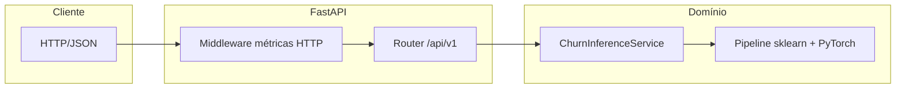
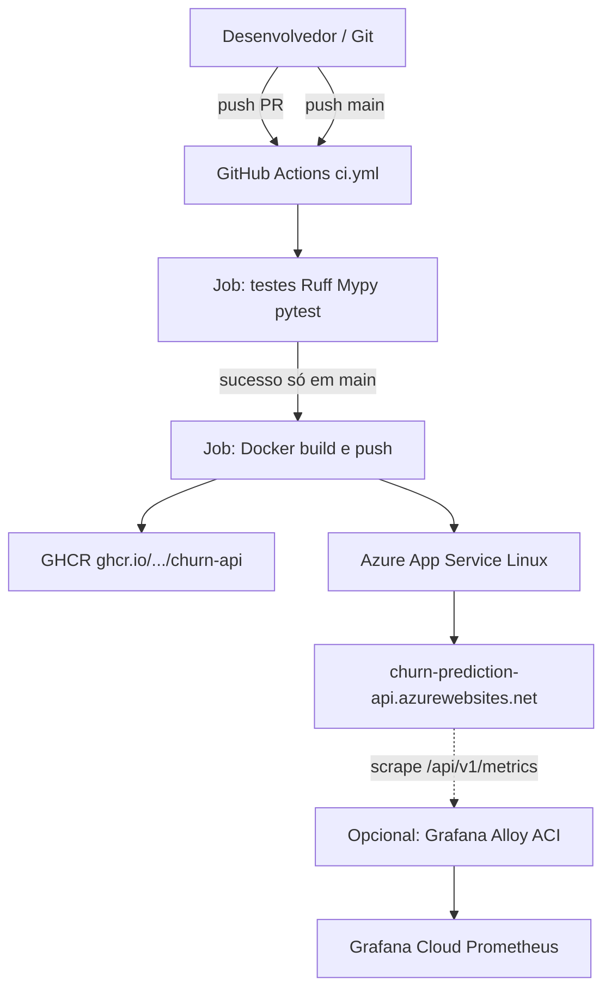

## VIDEO

### Demo de 60 segundos (para apresentação/vídeo)

Se você precisa demonstrar funcionando sem depender de slides:

1. Abrir o Swagger em `http://localhost:8000/docs` (ou produção no link da tabela).
2. Rodar uma predição no endpoint `POST /api/v1/inference/predict`.
3. Abrir `/api/v1/metrics/` e mostrar as séries `churn_predictions_total` e `model_inference_seconds`.
4. (Opcional) Mostrar o dashboard público do Grafana no link do README.

### Arquitetura da aplicação (lógica)

Fluxo em camadas, do pedido HTTP ao modelo:

- **`src/main.py`:** cria a app, *lifespan* (carrega `ChurnInferenceService` em `app.state`), regista middleware e routers.  
- **`src/routers/`:** `health`, `inference`, `metrics` (Prometheus).  
- **`src/services/inference_service.py`:** validação já feita pelo Pydantic → `DataFrame` → *feature engineering* → `predict_proba` → métricas + resposta.  
- **`src/metrics.py`:** registo Prometheus isolado (`CollectorRegistry`).  
- **Artefato:** `pickle` com `Pipeline` scikit-learn; o estimador neural está em [`utils/neural_net.py`](utils/neural_net.py).

### Arquitetura de implantação (infraestrutura)

Pipeline de entrega contínua e runtime em nuvem:

| Componente | Função |
|------------|--------|
| **GitHub Actions** | Um único workflow: qualidade em todas as branches; *build* + *deploy* só na `main` após testes. |
| **GHCR** | Registry da imagem versionada por commit (`:sha`) e `latest`. |
| **Azure App Service** | Puxa a imagem; variáveis como `WEBSITES_PORT` / *connection strings* conforme portal. |
| **Grafana Alloy** | Coleta métricas expostas pela API para dashboards remotos. |

Documentação de decisões (SKU, custos, segredos): [**docs/arquitetura-deploy.md**](docs/arquitetura-deploy.md).

---