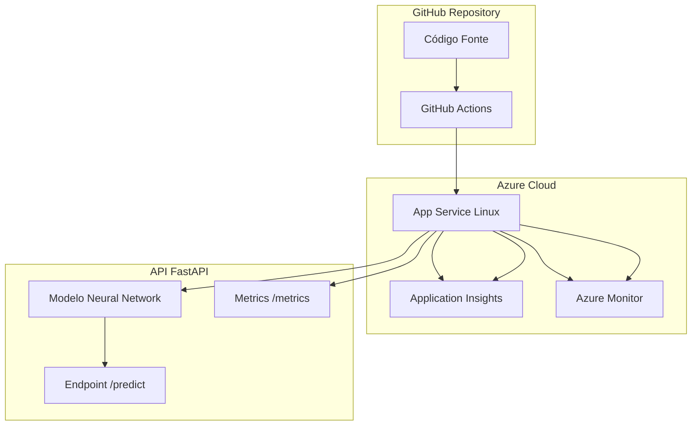

# Deploy da API no Azure via GitHub Actions

Este documento descreve o processo completo de deploy da API de Churn Prediction no Azure App Service usando GitHub Actions.

## Visão Geral

O projeto está configurado para deploy automático com:
- **CI/CD**: GitHub Actions pipeline
- **Infraestrutura**: Azure App Service (Linux)
- **Runtime**: Python 3.12
- **Modelo**: Neural Network (PyTorch)
- **Monitoramento**: Application Insights + Prometheus

## Arquitetura



## Pré-requisitos

### 1. Azure CLI
```bash
# Instalar Azure CLI
curl -sL https://aka.ms/InstallAzureCLIDeb | sudo bash

# Verificar instalação
az --version
```

### 2. Modelo Treinado
Certifique-se de que o modelo está treinado:
```bash
# Verificar se o modelo existe
ls -lh models/neural_network_pipeline.pkl

# Se não existir, execute o notebook de modelagem
jupyter notebook notebooks/03_modeling.ipynb
```

### 3. Permissões Azure
- Acesso a uma subscription Azure
- Permissões para criar recursos (Resource Group, App Service, etc.)

## Setup Passo a Passo

### Passo 1: Configurar Recursos Azure

```bash
# Executar script de setup
./scripts/azure_setup.sh

# O script irá:
# 1. Fazer login no Azure
# 2. Criar Resource Group (rg-churn-api)
# 3. Criar App Service Plan (asp-churn-api)
# 4. Criar Web App (churn-prediction-api)
# 5. Configurar runtime Python 3.12
```

### Passo 2: Configurar Monitoramento (Opcional mas Recomendado)

```bash
# Configurar Application Insights e alertas
./scripts/setup_monitoring.sh
```

### Passo 3: Configurar Secrets no GitHub

No repositório GitHub, vá para **Settings > Secrets and variables > Actions** e adicione:

#### 1. AZURE_CREDENTIALS
```bash
# Gerar Service Principal
az ad sp create-for-rbac \
  --name "github-actions-churn-api" \
  --role contributor \
  --scopes /subscriptions/<SUBSCRIPTION-ID>/resourceGroups/rg-churn-api \
  --sdk-auth

# Substituir <SUBSCRIPTION-ID> pelo seu ID de subscription
```

#### 2. AZURE_WEBAPP_PUBLISH_PROFILE
```bash
# Obter perfil de publicação
az webapp deployment list-publishing-profiles \
  --name churn-prediction-api \
  --resource-group rg-churn-api \
  --query '[?publishMethod=="ZipDeploy"]'
```

#### 3. APPLICATIONINSIGHTS_CONNECTION_STRING (Opcional)
```bash
# Obter connection string
az monitor app-insights component show \
  --app churn-prediction-api-insights \
  --resource-group rg-churn-api \
  --query connectionString
```

### Passo 4: Verificar Pré-requisitos

```bash
# Executar verificação completa
./scripts/check_deploy_prerequisites.sh

# O script verificará:
# ✅ Modelo neural_network existe
# ✅ Dependências Python estão instaladas
# ✅ Estrutura da API está correta
# ✅ GitHub Actions workflow está configurado
```

### Passo 5: Executar Primeiro Deploy

1. **Método 1: Push para main**
   ```bash
   git add .
   git commit -m "feat: primeiro deploy Azure"
   git push origin main
   ```

2. **Método 2: Executar workflow manualmente**
   - No GitHub, vá para **Actions**
   - Selecione **Deploy FastAPI to Azure App Service**
   - Clique em **Run workflow**
   - Selecione a branch **main**

## Workflow GitHub Actions

### Jobs Executados

1. **test** (sempre executado)
   - Checkout do código
   - Setup Python 3.12
   - Instalação de dependências
   - Execução de testes

2. **build-and-deploy** (apenas em push na main)
   - Validação do modelo
   - Build otimizado para Azure
   - Instalação PyTorch CPU-only
   - Criação do pacote de deploy
   - Deploy para Azure App Service
   - Configuração de monitoramento
   - Health check automático

### Otimizações Implementadas

#### 1. Cache de Dependências
- Cache do `~/.cache/uv` para builds mais rápidos
- Reutilização entre execuções

#### 2. PyTorch CPU-only
- Versão otimizada para Azure App Service
- Sem dependências CUDA (menor tamanho)

#### 3. Pacote de Deploy Minimalista
- Apenas código necessário (exclui notebooks, dados)
- Apenas modelo neural_network (exclui outros modelos)
- Configurações otimizadas para produção

#### 4. Health Check Automático
- Validação dos endpoints após deploy
- Teste de inferência com dados de exemplo
- Verificação de métricas Prometheus

## Verificação Pós-Deploy

### 1. Health Check Automático
O workflow inclui verificação automática. Para verificar manualmente:

```bash
./scripts/health_check.sh

# Ou especificar outro nome de app
./scripts/health_check.sh meu-app-churn
```

### 2. Testar Endpoints Manualmente

```bash
# Health check
curl https://churn-prediction-api.azurewebsites.net/api/v1/health

# Métricas Prometheus
curl https://churn-prediction-api.azurewebsites.net/api/v1/metrics/

# Documentação
open https://churn-prediction-api.azurewebsites.net/docs

# Inferência (exemplo)
curl -X POST https://churn-prediction-api.azurewebsites.net/api/v1/inference/predict \
  -H "Content-Type: application/json" \
  -d '{
    "tenure_months": 12,
    "monthly_charges": 70.35,
    "total_charges": 844.20,
    "state": "CA",
    "gender": "Male",
    "senior_citizen": "No",
    "partner": "Yes",
    "dependents": "No",
    "phone_service": "Yes",
    "multiple_lines": "No",
    "internet_service": "Fiber optic",
    "online_security": "No",
    "online_backup": "Yes",
    "device_protection": "No",
    "tech_support": "No",
    "streaming_tv": "Yes",
    "streaming_movies": "No",
    "contract": "Month-to-month",
    "paperless_billing": "Yes",
    "payment_method": "Electronic check"
  }'
```

## Monitoramento

### 1. Application Insights
- Métricas de performance
- Logs estruturados
- Exceções não tratadas
- Dependências externas

**Acessar:** Portal Azure > Application Insights > churn-prediction-api-insights

### 2. Métricas Prometheus
Endpoint: `/api/v1/metrics/`

Métricas disponíveis:
- `churn_predictions_total`: Contador de predições
- `model_inference_seconds`: Latência de inferência
- `http_requests_total`: Contador de requisições HTTP
- `model_loaded`: Status do modelo (0=erro, 1=ok)

### 3. Logs do App Service
```bash
# Ver logs em tempo real
az webapp log tail \
  --name churn-prediction-api \
  --resource-group rg-churn-api

# Download dos logs
az webapp log download \
  --name churn-prediction-api \
  --resource-group rg-churn-api
```

## Troubleshooting

### Problema: Modelo não carrega
**Sintoma**: Erro `ModelNotLoadedError` no startup
**Solução**:
1. Verificar se o modelo existe no pacote de deploy
2. Verificar permissões de leitura
3. Testar carga localmente: `python -c "import pickle; pickle.load(open('models/neural_network_pipeline.pkl', 'rb'))"`

### Problema: Dependências não instalam
**Sintoma**: Erro durante `pip install`
**Solução**:
1. Verificar versão Python (deve ser 3.12)
2. Verificar conexão com PyPI
3. Testar instalação local: `pip install -r requirements-azure.txt`

### Problema: API não responde
**Sintoma**: Timeout ou erro 502
**Solução**:
1. Verificar logs: `az webapp log tail`
2. Verificar se o processo está rodando
3. Verificar configuração do startup command

### Problema: Métricas não aparecem
**Sintoma**: Endpoint `/api/v1/metrics/` não responde
**Solução**:
1. Verificar se `prometheus-client` está instalado
2. Verificar configuração do endpoint
3. Verificar logs da aplicação

## Manutenção

### Atualizar Dependências
Edite os arquivos de requirements:
- `requirements.txt`: Desenvolvimento
- `requirements-api.txt`: API básica
- `requirements-azure.txt`: Azure (gerado automaticamente)

### Atualizar Modelo
1. Treinar novo modelo no notebook `03_modeling.ipynb`
2. Salvar como `models/neural_network_pipeline.pkl`
3. Fazer commit e push para main

### Escalabilidade
- **App Service Plan**: Atualize de B1 para S1/S2/P1V2 para mais recursos
- **Auto-scaling**: Configure no portal Azure
- **CDN**: Adicione Azure CDN para conteúdo estático

## Custos Estimados

| Recurso | Tier | Custo Mensal Estimado |
|---------|------|-----------------------|
| App Service Plan | B1 (Basic) | ~R$ 70,00 |
| Application Insights | Gratuito (5GB/mês) | R$ 0,00 |
| Azure Monitor | Gratuito (métricas básicas) | R$ 0,00 |
| **Total** | | **~R$ 70,00** |

## Recursos Úteis

- [Documentação Azure App Service](https://docs.microsoft.com/azure/app-service/)
- [GitHub Actions para Azure](https://github.com/Azure/actions)
- [FastAPI no Azure](https://fastapi.tiangolo.com/deployment/)
- [PyTorch CPU-only](https://pytorch.org/get-started/locally/)

## Suporte

Para problemas com o deploy:
1. Verifique os logs do GitHub Actions
2. Consulte os logs do App Service
3. Verifique a documentação do Azure
4. Abra uma issue no repositório