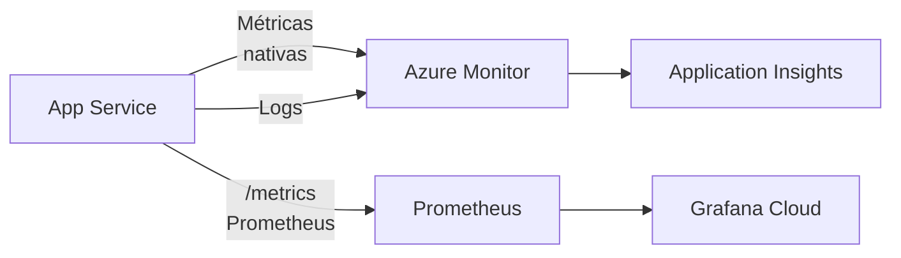
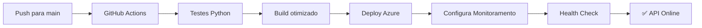

# Monitoramento da API de Churn Prediction

Este documento descreve a stack de monitoramento implementada usando **Azure Monitor + Prometheus + Grafana Cloud** (free tier).

## Arquitetura



## Componentes Implementados

### 1. Métricas Prometheus

**Endpoint:** `GET /api/v1/metrics/`

**Métricas expostas:**

| Métrica | Tipo | Descrição |
|---------|------|-----------|
| `churn_predictions_total` | Counter | Total de predições (labels: `churn`, `nao_churn`) |
| `model_inference_seconds` | Histogram | Latência de inferência do modelo |
| `churn_probability_histogram` | Histogram | Distribuição de probabilidades |
| `http_requests_total` | Counter | Total de requisições HTTP |
| `http_request_duration_seconds` | Histogram | Duração de requisições HTTP |
| `model_loaded` | Gauge | Status do modelo (0=erro, 1=ok) |

### 2. Logs Estruturados

O serviço já está instrumentado com `structlog` para logs estruturados em JSON.

## Configuração no Azure

### Setup Automático via GitHub Actions

O workflow de deploy configurado automaticamente:

1. **Application Insights**: Configurado automaticamente se `APPLICATIONINSIGHTS_CONNECTION_STRING` estiver definido
2. **Métricas Prometheus**: Endpoint `/api/v1/metrics/` configurado para scraping
3. **Logs estruturados**: Configurados com structlog em formato JSON

### Setup Manual (Alternativo)

#### Opção 1: Application Insights (Recomendado - Grátis)

1. **Criar Application Insights:**
   ```bash
   az monitor app-insights create \
     --app churn-prediction-insights \
     --location eastus
   ```

2. **Obter Connection String:**
   ```bash
   az monitor app-insights show \
     --app churn-prediction-insights \
     --query connectionString
   ```

3. **Adicionar secrets no GitHub:**
   - `APPLICATIONINSIGHTS_CONNECTION_STRING`

4. **O Azure coletará automaticamente:**
   - CPU, memória, requisições HTTP
   - Exceções não tratadas
   - Logs estruturados
   - Dependências e performance

#### Script de Configuração Automática

Execute o script de setup:
```bash
./scripts/setup_monitoring.sh
```

Este script configura:
- Application Insights com connection string
- Logs de diagnóstico
- Alertas básicos para erros HTTP
- Integração Prometheus

### Opção 2: Prometheus Scraper (Preview Grátis)

O Azure Managed Prometheus pode coletar do endpoint `/metrics`:

```bash
# App Settings
WEBSITE_PROMETHEUS_SCRAPE_ENDPOINT=/api/v1/metrics/
WEBSITE_PROMETHEUS_PORT=8001
PROMETHEUS_ENABLED=true
```

**Nota:** Azure Managed Prometheus está em preview gratuito.

## Configuração do Grafana Cloud (Free Tier)

### 1. Criar Conta

1. Acesse [grafana.com](https://grafana.com/)
2. Cadastre-se no free tier (1k séries, 14 dias retention)

### 2. Adicionar Data Source

**Opção A: Prometheus**
1. Go to Connections > Data Sources
2. Add Prometheus
3. URL: `https://prometheus-us-central1.grafana.net/api/prom`
4. Token: Grafana Cloud > My Account > API Keys

**Opção B: Azure Monitor**
1. Add Azure Monitor data source
2. Configure Tenant ID, Client ID, Secret

### 3. Importar Dashboard

1. Go to Dashboards > Import
2. Upload `docs/grafana_dashboard.json`
3. Selecione o data source

## Dashboard - Painéis

O dashboard inclui:

| Painel | Descrição | Alerta Sugerido |
|--------|-----------|-----------------|
| Request Rate | Requisições/segundo | > 100 rps |
| HTTP Latency | p50, p95, p99 | p99 > 2s |
| Error Rate | Taxa 5xx | > 1% |
| Model Latency | Latência inferência | p99 > 1s |
| Predictions | Distribuição churn/nao_churn | - |
| Churn Probability | Percentis de probabilidade | - |
| Model Status | 0=não carregado, 1=ok | = 0 |
| Total Predictions | Contador acumulado | - |

## Custo Estimado

| Componente | Custo Mensal |
|------------|---------------|
| Azure Monitor (platform metrics) | R$0 |
| Application Insights (500MB) | R$0 |
| Azure Managed Prometheus | R$0 (preview) |
| Grafana Cloud (free tier) | R$0 |
| **TOTAL** | **R$0** |

## Verificação

### Testar Endpoint de Métricas

```bash
# Localmente
curl http://localhost:8000/api/v1/metrics/

# Produção
curl https://churn-prediction-api.azurewebsites.net/api/v1/metrics/
```

### Exemplo de Saída

```
# HELP churn_predictions_total Total de predições de churn
# TYPE churn_predictions_total counter
churn_predictions_total{prediction="nao_churn"} 1523.0
churn_predictions_total{prediction="churn"} 847.0

# HELP model_inference_seconds Latência de inferência do modelo
# TYPE model_inference_seconds histogram
model_inference_seconds_bucket{le="0.01"} 0.0
model_inference_seconds_bucket{le="0.025"} 45.0
...
model_inference_seconds_sum 234.5
model_inference_seconds_count 2370.0

# HELP churn_probability_histogram Distribuição de probabilidades de churn
# TYPE churn_probability_histogram histogram
churn_probability_histogram_bucket{le="0.1"} 890.0
...
```

## Troubleshooting

### Métricas não aparecem

1. Verifique se o endpoint `/api/v1/metrics/` responde
2. Verifique logs do App Service
3. Confirme que `prometheus-client` está instalado

### Application Insights não funciona

1. Verifique `APPLICATIONINSIGHTS_CONNECTION_STRING`
2. Confirme que `APPINSIGHTS_ENABLED=true`

### Grafana não conecta

1. Verifique data source URL
2. Confirme API key válida
3. Teste connectivity

## Próximos Passos

1. Configurar Application Insights no Azure
2. Criar conta no Grafana Cloud
3. Adicionar secrets no GitHub
4. Fazer deploy e verificar métricas
5. Importar dashboard JSON

## GitHub Actions Integration

O projeto inclui um workflow de CI/CD completo que configura automaticamente o monitoramento:

### Secrets Necessários

Configure os seguintes secrets no repositório GitHub:

| Secret | Descrição | Como obter |
|--------|-----------|------------|
| `AZURE_CREDENTIALS` | Service Principal para deploy | `az ad sp create-for-rbac --name "github-actions-churn-api" --role contributor --scopes /subscriptions/<id>/resourceGroups/rg-churn-api --sdk-auth` |
| `AZURE_WEBAPP_PUBLISH_PROFILE` | Perfil de publicação do App Service | `az webapp deployment list-publishing-profiles --name churn-prediction-api --resource-group rg-churn-api --query '[?publishMethod=="ZipDeploy"]'` |
| `APPLICATIONINSIGHTS_CONNECTION_STRING` | Connection string do Application Insights | `az monitor app-insights component show --app churn-prediction-insights --resource-group rg-churn-api --query connectionString` |

### Workflow de Deploy

O workflow `.github/workflows/deploy.yml` inclui:

1. **Testes automáticos**: Executa testes Python antes do deploy
2. **Build otimizado**: Cache de dependências, PyTorch CPU-only
3. **Deploy para Azure**: Configura App Service automaticamente
4. **Configuração de monitoramento**: Application Insights, Prometheus
5. **Health check**: Validação automática após deploy

### Scripts de Suporte

| Script | Descrição |
|--------|-----------|
| `scripts/azure_setup.sh` | Configura recursos Azure (App Service, Resource Group) |
| `scripts/setup_monitoring.sh` | Configura Application Insights e alertas |
| `scripts/check_deploy_prerequisites.sh` | Verifica pré-requisitos antes do deploy |
| `scripts/health_check.sh` | Testa API após deploy |

### Pipeline de CI/CD



## Próximos Passos

1. Configure os secrets no GitHub
2. Execute o script de setup: `./scripts/azure_setup.sh`
3. Execute o script de monitoramento: `./scripts/setup_monitoring.sh`
4. Faça push para a branch main para trigger do deploy
5. Verifique a API: `./scripts/health_check.sh`

## Referências

- [Azure Monitor Pricing](https://azure.microsoft.com/pricing/details/monitor/)
- [Grafana Cloud Free Tier](https://grafana.com/cloud/)
- [Prometheus Client Python](https://prometheus-client.readthedocs.io/)
- [GitHub Actions for Azure](https://github.com/Azure/actions)
- [Azure App Service Documentation](https://docs.microsoft.com/azure/app-service/)
