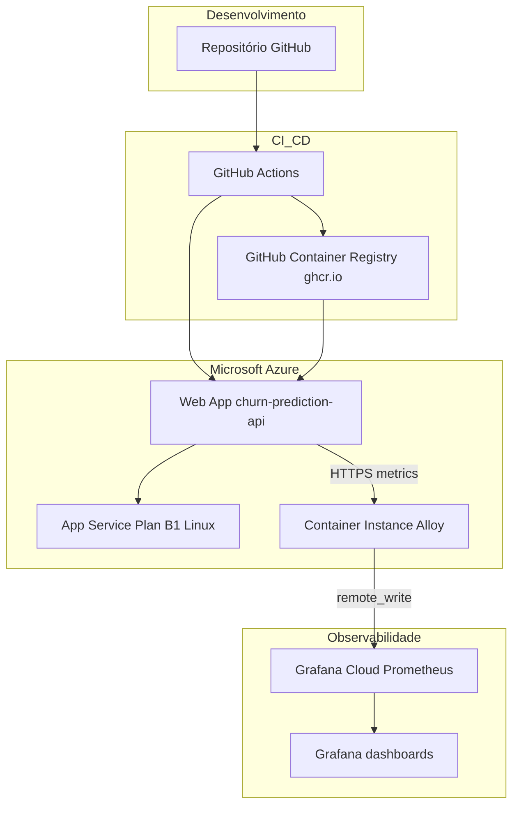

# Arquitetura de deploy da API de predição de churn

**Disciplina / contexto:** Tech Challenge — Pós-graduação FIAP Pós Tech (MVP de API de inferência com modelo de machine learning).

Este texto descreve como a solução foi colocada em produção na nuvem, quais componentes entram no fluxo e por que essas escolhas foram feitas em vez de alternativas que também aparecem em discussões de arquitetura.

## 1. Objetivo do deploy

O trabalho pedia uma API pública, estável o suficiente para demonstração e avaliação, servindo o modelo escolhido (rede neural / pipeline em pickle) sem depender da máquina local do grupo. Além disso, era desejável ter um caminho repetível: qualquer alteração no código ou no artefato do modelo deveria poder ser publicada com o mínimo de passos manuais e sem “configuração oculta” só na máquina de um integrante.

Com isso em mente, a arquitetura gira em torno de três ideias: **imagem de container imutável**, **pipeline automatizado no Git** e **hospedagem gerenciada** onde o foco fica na aplicação, não na manutenção de VMs.

## 2. Visão geral

Em linhas gerais, o fluxo é o seguinte:

1. O código e o artefato do modelo versionados no GitHub.
2. A cada integração na branch `main`, o GitHub Actions constrói uma imagem Docker, publica no GitHub Container Registry e instrui o Azure App Service a usar essa imagem.
3. A API responde em HTTPS pelo domínio `*.azurewebsites.net`.
4. Para monitoramento, um coletor (Grafana Alloy) em Azure Container Instance faz *scrape* do endpoint Prometheus da API e envia as séries para o Prometheus hospedado no Grafana Cloud (*remote write*).

O desenho abaixo resume as relações entre esses elementos:

## 3. Componentes e responsabilidades

### 3.1 Aplicação em container (Dockerfile)

A API é FastAPI; em produção ela roda atrás do Gunicorn com *workers* Uvicorn. O Dockerfile usa imagem base `python:3.11-slim`, instala dependências a partir do `requirements.txt` e copia o código em `src/`, além do arquivo `models/neural_network_pipeline.pkl` e de `utils/` (necessários para deserialização e consistência com o treino).

**Por que container:** o ambiente de build fica explícito no repositório. Quem revisa o trabalho ou replica o deploy vê exatamente qual versão de Python e quais bibliotecas foram usadas. Isso reduz o problema clássico de “funciona na minha máquina” e alinha com o que se espera em projetos de pós: rastreabilidade e reprodutibilidade.

**PyTorch CPU-only:** o *wheel* vem do índice oficial de CPU da PyTorch, o que evita depender de GPU no App Service (onde não há acelerador dedicado no plano usado) e mantém a imagem mais previsível em custo e tamanho.

**Modelo dentro da imagem:** o `.pkl` entra no build. A alternativa seria baixar o modelo de um blob no *startup*; isso adicionaria segredo de storage, latência de cold start e mais pontos de falha. Para um MVP acadêmico com artefato pequeno, embutir no *layer* da imagem simplifica o desenho e garante que a tag da imagem e o modelo andam juntos.

### 3.2 Registro de imagens: GitHub Container Registry (ghcr.io)

As imagens são publicadas em `ghcr.io/<organização ou usuário>/<repositório>/churn-api`, com tags `latest` e o SHA do commit.

**Por que não ficar só no Azure Container Registry (ACR):** o ACR Basic tem custo mensal fixo. No cenário de estudante com crédito limitado no Azure, eliminar o ACR e usar o GHCR (incluído no uso do GitHub para repositório público) foi uma forma de manter o mesmo fluxo “build → push → deploy” sem mais um serviço cobrado. O trade-off é que a política de visibilidade do pacote no GitHub precisa estar coerente com o repositório (no nosso caso, repositório público e imagem acessível para *pull* pelo App Service).

### 3.3 Azure App Service (Linux, contentor)

O Web App `churn-prediction-api` roda no plano `asp-churn-api`, atualmente em SKU **B1** (Linux). O Azure puxa a imagem do GHCR e expõe a aplicação na porta configurada (8000 no container, mapeada via `WEBSITES_PORT` nas *application settings*).

**Por que App Service e não, por exemplo, só uma VM:** App Service abstrai patch de SO do anfitrião, renovação de certificado na frente HTTPS do domínio `azurewebsites.net` e integração simples com o deploy por imagem. Para o escopo do desafio, isso concentrava o esforço em ML e API, não em administração de servidor.

**Por que B1 e não o tier gratuito F1:** o F1 não atende ao cenário de aplicação Linux em contentor personalizado da forma que precisávamos; o plano pago básico foi o menor degrau que permitia Docker + memória suficiente para PyTorch e workers. Foi também um compromisso com o orçamento: reduzimos de B2 para B1 quando analisamos o uso real e o tamanho do modelo.

### 3.4 Integração contínua: GitHub Actions

O ficheiro `.github/workflows/ci.yml` corre **testes** (lint, Mypy, pytest) em todas as branches. O *job* de **build e deploy** só corre na `main`, depois de o *job* de testes concluir com sucesso, e dispara em *push* à `main` ou por execução manual (`workflow_dispatch`). Os passos de deploy fazem *login* no GHCR com `GITHUB_TOKEN`, *build* com cache do Buildx, *push* das tags, *login* no Azure com um *service principal* (segredo `AZURE_CREDENTIALS`) e chamada à ação `azure/webapps-deploy` apontando para a imagem com tag do commit.

**Justificativa:** o repositório já estava no GitHub; manter o CI no mesmo sítio evita multiplicar fornecedores e segredos. O uso de tag por SHA em vez de só `latest` no deploy ajuda a auditoria (cada deploy no portal pode ser correlacionado com um commit).

### 3.5 Observabilidade: Alloy + Grafana Cloud

O endpoint `/api/v1/metrics/` expõe métricas no formato Prometheus. O Grafana Cloud não consegue, por si só, “entrar” na VNet da aplicação; por isso foi colocado um **Grafana Alloy** num **Azure Container Instance** na mesma região/subscrição do grupo de recursos: ele acede ao URL público HTTPS da API, faz *scrape* periódico e envia os dados via *remote write* autenticado para o Prometheus gerido do Grafana Cloud.

**Por que esse desenho:** é o padrão *pull* do Prometheus aplicado a um alvo na Internet, sem abrir a API a configurações proprietárias do Azure que mudariam o foco do trabalho. O custo do ACI pequeno foi aceite como troca por gráficos e alertas no Grafana Cloud já incluídos no *stack* do aluno.

**Nota sobre o código da API:** o middleware passou a incrementar `http_requests_total` e `http_request_duration_seconds`, porque o dashboard importado no Grafana esperava essas séries; antes só havia métricas de negócio e de inferência.

## 4. Decisões que não foram tomadas (e por quê)

- **Kubernetes (AKS):** seria desproporcional para uma única API e um modelo pequeno; aumentaria custo, curva de aprendizagem e superfície operacional sem requisito explícito do desafio.

- **Azure Functions com modelo embutido:** o cold start e os limites de pacote para stacks com PyTorch tornam o caminho menos direto do que um contentor único no App Service.

- **Somente ZIP deploy sem Docker:** empacotar PyTorch e dependências nativas via Oryx costuma gerar mais fricção e builds mais lentos; o Dockerfile deixa o runtime explícito.

## 5. Segredos e boas práticas

- Credenciais do Azure para o pipeline ficam em *secrets* do GitHub, não no repositório.
- Tokens do Grafana Cloud para *remote write* não devem ser commitados; no ambiente real eles são injetados como variáveis seguras no ACI ou num cofre.
- O *service principal* usado pelo Actions deve ter âmbito mínimo (por exemplo, apenas o *resource group* do projeto).

## 6. Limitações conscientes

Esta arquitetura é adequada a um **MVP** e a uma disciplina de pós-graduação: não inclui, por exemplo, *staging* separado, *blue/green*, nem *WAF* dedicado. Em ambiente corporativo eu esperaria ambientes múltiplos, políticas de imagem assinadas, *secret* rotation e SLAs definidos com o negócio. O documento deixa isso explícito para não confundir o escopo académico com um desenho de produção crítica.

## 7. Referências rápidas no repositório

| Artefato | Função |
|----------|--------|
| `Dockerfile` | Definição da imagem de produção |
| `.github/workflows/ci.yml` | Pipeline CI/CD (testes → build → deploy na `main`) |
| `monitoring/alloy-config.alloy` | Configuração do coletor Prometheus → Grafana Cloud |
| `monitoring/deploy-alloy.sh` | Script auxiliar para criar ACI e *file share* com a config |
| `docs/grafana_dashboard.json` | Dashboard para importar no Grafana |

---

*Documento elaborado no âmbito do Tech Challenge da FIAP Pós Tech, descrevendo decisões reais do grupo no repositório e o raciocínio por detrás delas.*
